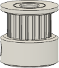
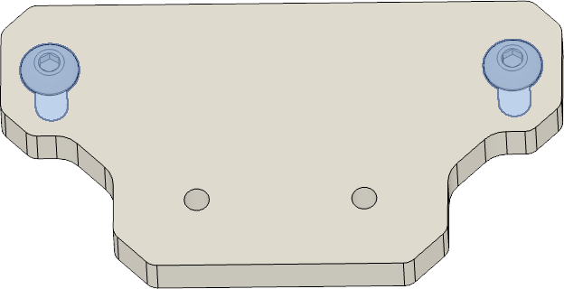
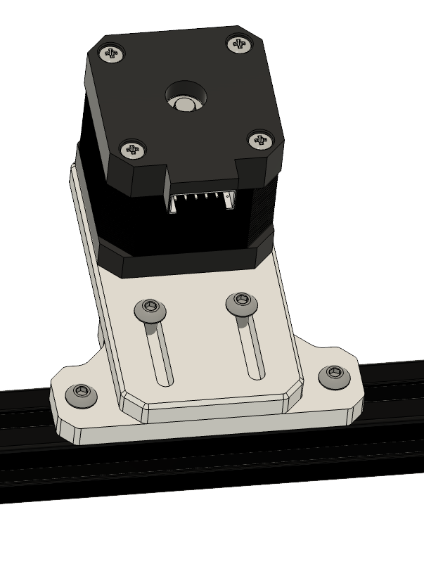
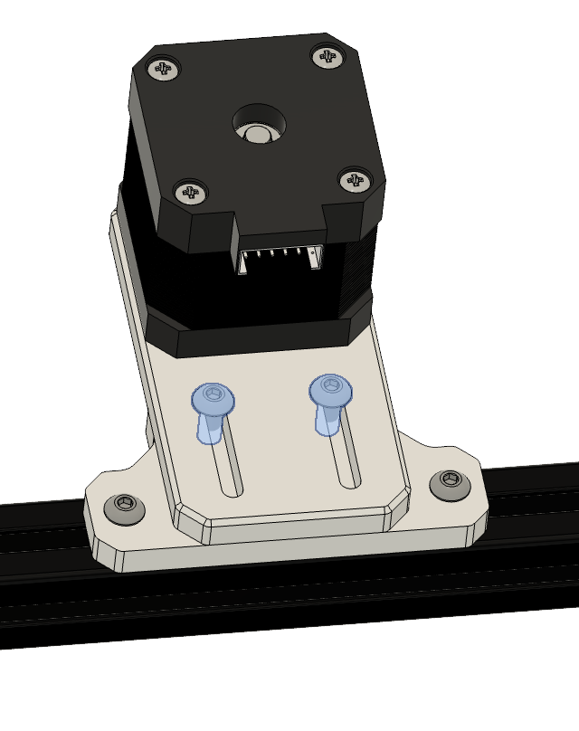

 

 
 

# Part's

| Part | Location | Info |
|:-------------|:------------------|
| M3 x 10mm   Quantity: 4 | **Layer**: 3   **Box**: VZ330 Box 6   **Bag**: M3   **Bagnumber**: 16/16 |  |
| M4 x 10mm   Quantity: 4 | **Layer**: 3   **Box**: VZ330 Box 6   **Bag**: M4   **Bagnumber**: 14/16 |  |
| M4 t-nut   Quantity: 2 | **Layer**: 3   **Box**: VZ330 Box 6   **Bag**: M4   **Bagnumber**: 2/16 |  |
| GT2 20 teeth   Quantity: 1 | **Layer**: 1 |  |
| NEMA 17 stepper   Quantity: 1 | **Layer**: 1 |  |
| Motor mount plate   Quantity: 1 | **Layer**: 1 |  |
| Extrutsion mount plate   Quantity: 1 | **Layer**: 1 |  |

# Assembly

## Step 1

### Notes

|:-|
|  |

| Part | Location |
|:-|:-|
| NEMA 17 motor   Quantity: 1 | **Layer**: 1 |
| GT2 20 teeth idler   Quantity: 1 | **Layer**: 1 |

 

### Instructions

|:-|:-|
|  | &#8226; Attach the GT2 idler to the motor shaft of the nema 17 motor ( we will align it later ) |
{: .instructiontable}

 

## Step 2

### Notes

{: .highlight }
> Required
>
> &#8226; Box 6 - M3 - 16/16

|:-|
|  |

| Part | Location |
|:-|:-|
| NEMA 17 motor   Quantity: 1 | **Layer**: 1 |
| Motor mount plate  Quantity: 1 | **Layer**: 1 |
| M3 x 10mm   Quantity: 4 | **Layer**: 3   **Box**: VZ330 Box 6   **Bag**: M3   **Bagnumber**: 16/16 |

 

### Instructions

|:-|:-|
|  | &#8226; Attach the NEMA 17 motor to the motor mount plate with the four M3 x 10mm screws   &#8226; Take care that the motor cable points to the back ( the side with the slides in the plate) |
{: .instructiontable}

 

## Step 3

### Notes

{: .highlight }
> Required
>
> &#8226; Box 6 - M4 - 14/16  
> &#8226; Box 6 - M4 - 2/16

|:-|
|  |

| Part | Location |
|:-|:-|
| Extrutsion mount plate   Quantity: 1 | **Layer**: 1 | 
| M4 x 10mm   Quantity: 2 | **Layer**: 3   **Box**: VZ330 Box 6   **Bag**: M4   **Bagnumber**: 14/16 |
| M4 t-nut   Quantity: 2 | **Layer**: 3   **Box**: VZ330 Box 6   **Bag**: M4   **Bagnumber**: 2/16 |

 

### Instructions

|:-|:-|
|  | &#8226; Attach the M4 x 10 mm screw and the M4 t-nut to the plate |
{: .instructiontable}

 

## Step 4

### Notes

|:-|
|  |

| Part | Location |
|:-|:-|
| Extrusion mount plate   Quantity: 1 | **Layer**: 1 |

 

### Instructions

|:-|:-|
|  | &#8226; Attach the extrusion mount plate to the frame ( take care it's in the middle of the back extrusion ) |
{: .instructiontable}

 

## Step 5

### Notes

{: .highlight }
> Required
>
> &#8226; Box 6 - M4 - 14/16

|:-|
|  |

| Part | Location |
|:-|:-|
| Assembled motor mount   Quantity: 1 | [Part from step 2](#step-2) |
| M4 x 10mm   Quantity: 2 | **Layer**: 3   **Box**: VZ330 Box 6   **Bag**: M4   **Bagnumber**: 14/16 |

 

### Instructions

|:-|:-|
|  | &#8226; Put the assembled mount on the extrusion plate and screw in the M4 x 10mm screws slightly |
{: .instructiontable}

 

### Step 6

- Put on the z-belt and tighten the belt by pulling the motor back and fixate it with the slightly screwed in M4 x 10mm screws.
- Loose the GT2 grub screws and align the belt that it is horizontal and tighten the grub screws on the flat spots of the motor after.