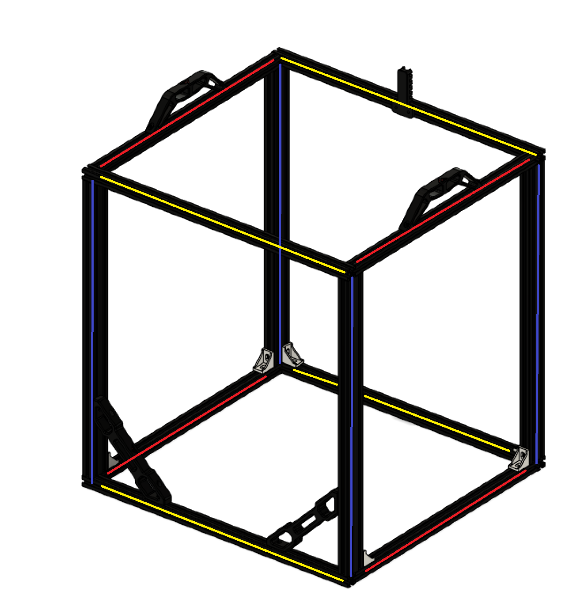
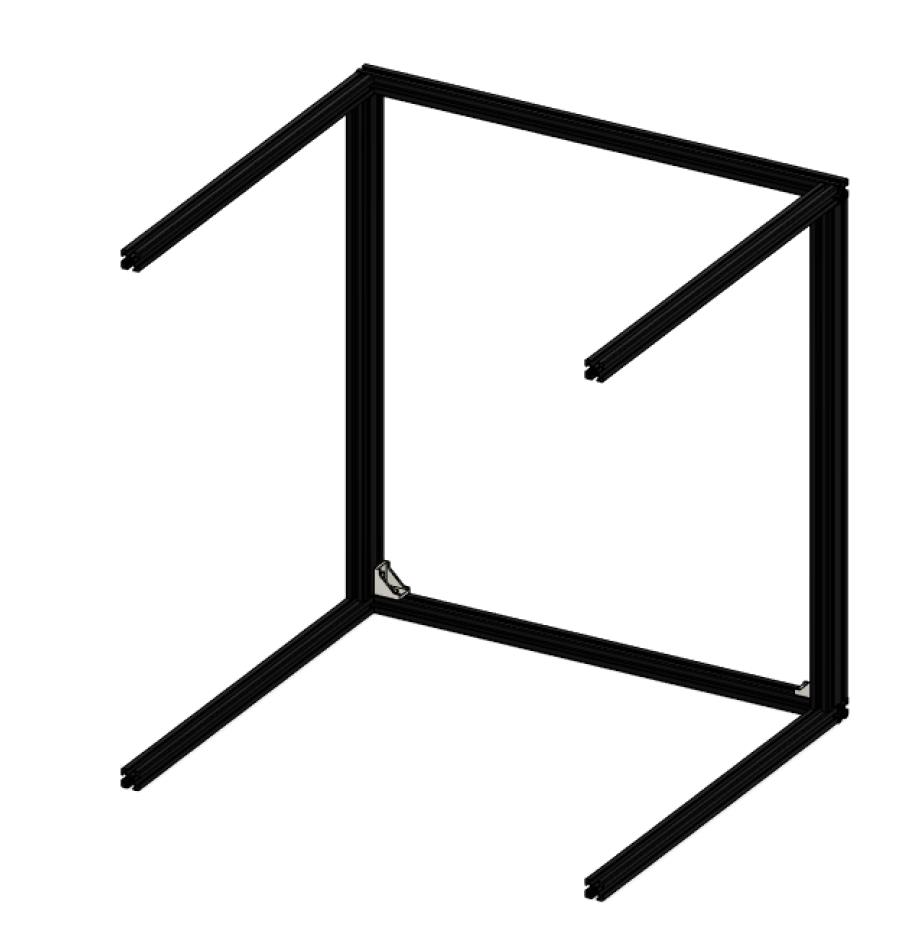
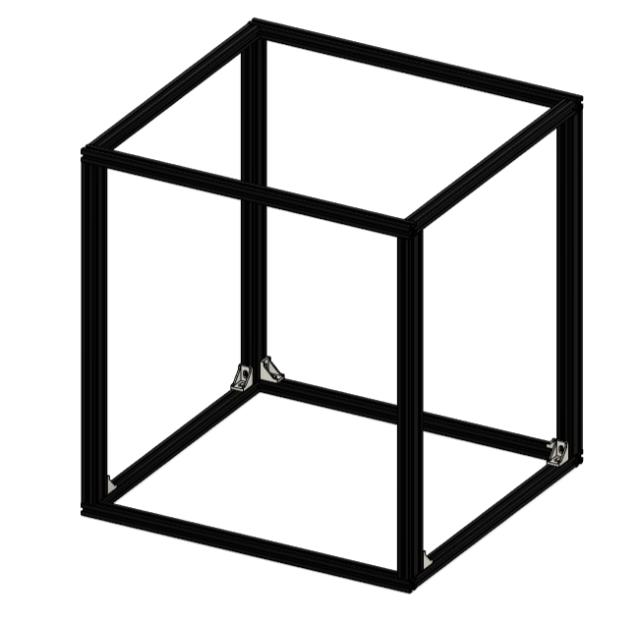

# Frame

## Overview

The frame is assembled through a combination of blind joints and corner brackets. The corner brackets are to help stiffen up the frame and are optional, though we highly recommend using them on every possible corner for best results.

⚠️ Build your printer on a flat, even surface such as a granite countertop or glass table surface. This will help with keeping the frame square and aligned.

## Parts and materials

### Hardware

| Material                | Quantity | Notes                                     |
| ----------------------- | -------- | ----------------------------------------- |
| M6/M5\* 10mm buttonhead | 16       | \*Depending on the type of 2020 extrusion |
| 530mm 2020 extrusions   | 4        | Yellow on CAD                             |
| 460mm 2020 extrusions   | 6        | Red on CAD                                |
| 530mm 2040 extrusions   | 4        | Blue on CAD; all ends tapped              |
| 2020 corner joints      | 8        |                                           |
| M4 T nuts               | 10       |                                           |
| M4 10mm                 | 2        |                                           |
| M4 15/16mm              | 8        |                                           |

### Printed parts

| Part / file    | Quantity |
| -------------- | -------- |
| [Frame_brace]  | 2        |
| [Handle]       | 2        |
| [Cable holder] | 1        |

## Step 1

Start by building the front and rear of your frame. Use the **blue** and **yellow** extrusions for this. 
Make sure everything is as square as possible, and **hand tighten** these screws for now.

Optionally, add the corner braces on the bottom of each frame.

Check the two halves by lying them on top of each other with all corners exactly in the same spot. Ensure both frames match and are not bowed, twisted or otherwise deformed. Parallelity of both frames' vertical extrusions is crucial to the proper functioning of the printer.

For more detail on blind joints, please see the [Blind joints](/general/misc-info/blind-joints.md) documentation. 

## Step 2

Loosely attach four "Red" extrusions to the rear frame to form a sideways lying "table" as shown.

## Step 3

Next, attach the front and rear frames to each other to form the cuboid shape of the finished frame. 

## Step 4

Install any remaining small corner brackets, and install the large front corner braces.

Install the handles and the cable holder.

Tighten all joints down and perform one final check of the frame squareness.

Your printer's frame should now look something like this:

Congratulation! Your base frame is now assembled. This is the start of something truly impressive. The frame is the foundation of everything your printer will be made out of. It's therefor paramount this frame remains square and true.

[Cable holder]: https://github.com/VzBoT3D/VzBoT-Vz330/blob/master/Assemblies%20BOM%20and%20STL/Frame/STLs/cable%20holder%20frame%20side.stl
[Frame_brace]: https://github.com/VzBoT3D/VzBoT-Vz330/blob/master/Assemblies%20BOM%20and%20STL/Frame/STLs/Frame_Brace.stl
[Handle]: https://github.com/VzBoT3D/VzBoT-Vz330/blob/master/Assemblies%20BOM%20and%20STL/Frame/STLs/handle.stl